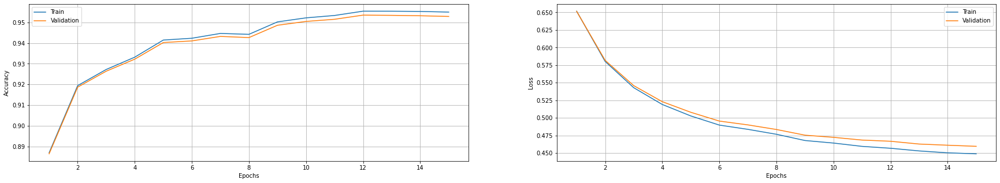

# Autonomous Car Camera Semantic Segmentation

This repository is an adapted version of https://github.com/aakaashjois/Autonomous-Car-Camera-Segmentation used in the task of semantic segmentation for my final year project in Data Science and Analytics.

## Dataset
The dataset used in this project consists of ~120,000 RGB images collected from the CARLA simulator and their corresponding semantically labelled images which act as the 'ground truth'. After 15 epochs over this dataset training stabilises and a high degree of accuracy is achieved.

## Training procedure
Two loss functions were explored, a Tversky Dice weighted cross entropy and a weighted cross entropy loss (the weights correspond to the inverse frequency of the class label). As we can see below the network converges faster when using the Tversky Dice Weighted Cross Entropy loss.
  
## Results
### Tversky Dice Weighted Cross Entropy
Training Metrics:

Original Images:

Original Masks:

Predicted Masks:

### Weighted Cross Entropy
Training Metrics:

Original Images:

Original Masks:

Predicted Masks:
